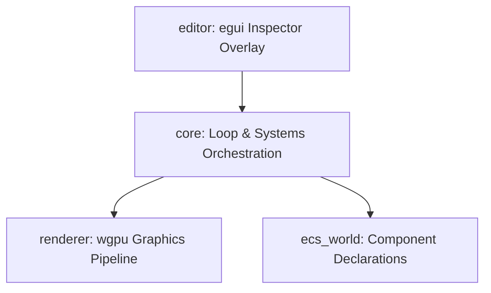

# 3D ECS Game Engine Prototype

A modular, high-performance, data-driven 3D game engine prototype built in **Rust** using **wgpu** (targeting native **Metal** on Apple Silicon) and the **flecs_ecs** archetype Entity Component System.

---

## 🏗️ Architecture

The workspace is split into four decoupled crates to enforce clean physical boundaries, prevent compile-time inflation, and optimize cache performance:



*   **`core`**: The main orchestrator. It manages the `winit` windowing shell, updates the deterministic clock ticker, executes CPU frustum culling, and coordinates the frame rendering cycle.
*   **`renderer`**: A decoupled, stateless rendering library. It manages the modern `wgpu` graphics adapter configurations, pipeline bind groups, dynamic instance buffer sizing, and standard flat-shading WGSL shaders.
*   **`ecs_world`**: The database schema of the engine, containing the definitions of core ECS components (`Transform3D`, `Velocity3D`, `RenderMeshReference`, `Camera`).
*   **`editor`**: An immediate-mode debugging dashboard implemented via `egui`, allowing real-time monitoring of entity trees, component inspectors, search filters, and physics switches.

---

## ✨ Features

*   **Modern Graphics API (Metal/wgpu)**: Custom low-latency pipeline with 2-frame buffering, depth buffering, and instanced drawing.
*   **Cache-Aligned Archetype ECS**: Direct integration of `flecs_ecs` for linear component memory layouts.
*   **Deterministic Game Clock**: Employs a time accumulator clock to run physics steps at a stable 60Hz tick, independent of variable frame rendering rate.
*   **6-Plane Frustum Culling**: Homogeneous clip space bounding sphere checking ($R = s \cdot \frac{\sqrt{3}}{2}$) to skip rendering objects outside the camera's view frustum.
*   **Bidirectional Camera Sync**: Synchronizes camera properties dynamically between the spatial `Transform3D` and the perspective `Camera` component, allowing inspectors to edit either parameter natively.
*   **Interactive Hierarchy & Inspector**: Search, inspect, and modify component coordinates, velocities, and mesh assignments dynamically.
*   **Conditional Physics Simulation**: Seamlessly pause/resume physics simulation from the UI while maintaining clock step accumulation to prevent post-pause velocity catch-up spikes.

---

## 🚀 Getting Started

### Prerequisites

*   **Rust**: Ensure stable Rust is installed.
*   **Apple Silicon Target**: Fully optimized to leverage Metal on Apple Silicon macOS devices.

### Compilation

To compile the workspace, run the following:
```bash
cargo build --release
```

> [!NOTE]
> Compilation configuration `.cargo/config.toml` limits parallel jobs to `jobs = 4` to optimize memory footprints on 8GB Apple Silicon models (MacBook Air/Pro).

### Running the Engine

Start the engine runtime in release mode:
```bash
cargo run --release --bin core
```

---

## 🛠️ Editor Controls

1.  **Hierarchy Panel**: Inspect active entities in the world tree.
2.  **Search Bar**: Live-search entities by ID or name string.
3.  **Property Inspector**: Modify spatial properties (`position`, `rotation`, `scale`), velocities, and mesh indexes of selected entities on the fly.
4.  **Simulate Physics Switch**: Pause or resume boundaries bouncing without timing hitches.
5.  **Camera Controller**: Select the **"Main Camera"** entity in the Hierarchy to dynamically adjust FOV, znear/zfar planes, and camera eye location.
